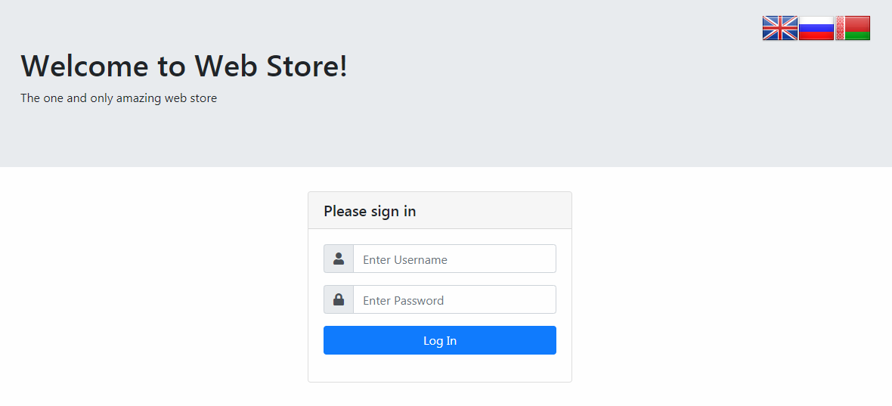
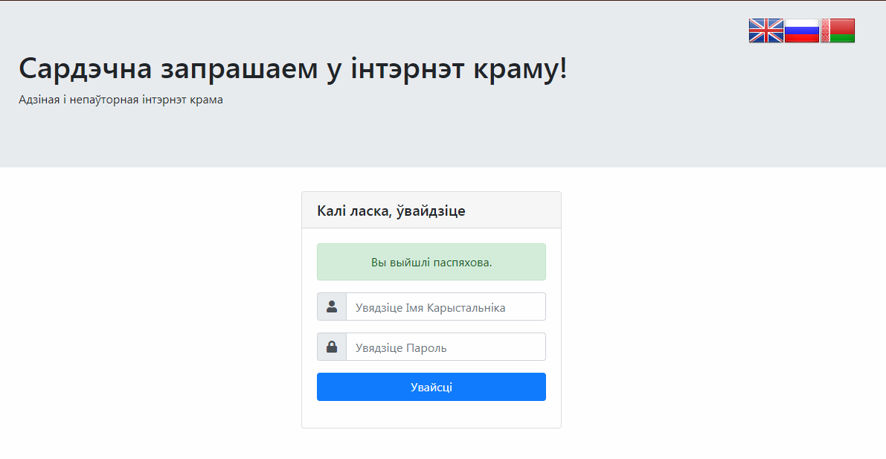
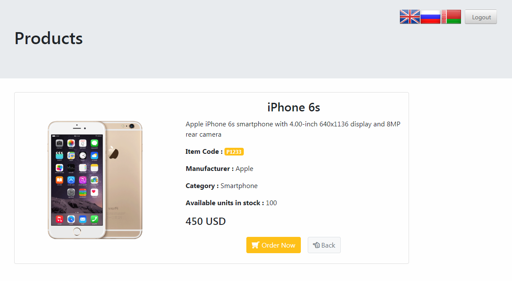
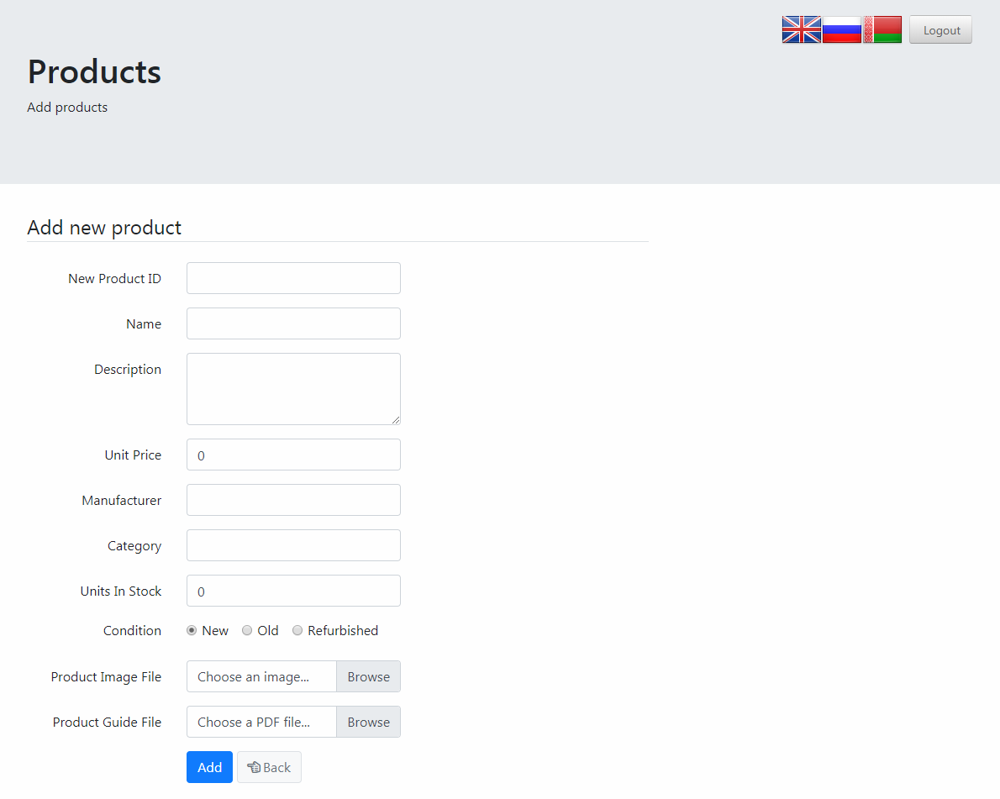

# Spring MVC beginners guide. (the second edition)

Web application from the book.

Stack:
* Spring MVC
* Spring Security
* Spring Webflow
* HSQLDB
* Lombok
* Log4j2
* JSTL + java-time-jsptags
* Bootstrap 4.3 + Fontawesome 5.7
* Jackson
* Xstream
* Testing:
    * JUnit 5
    * Spring Test

Screenshots:

